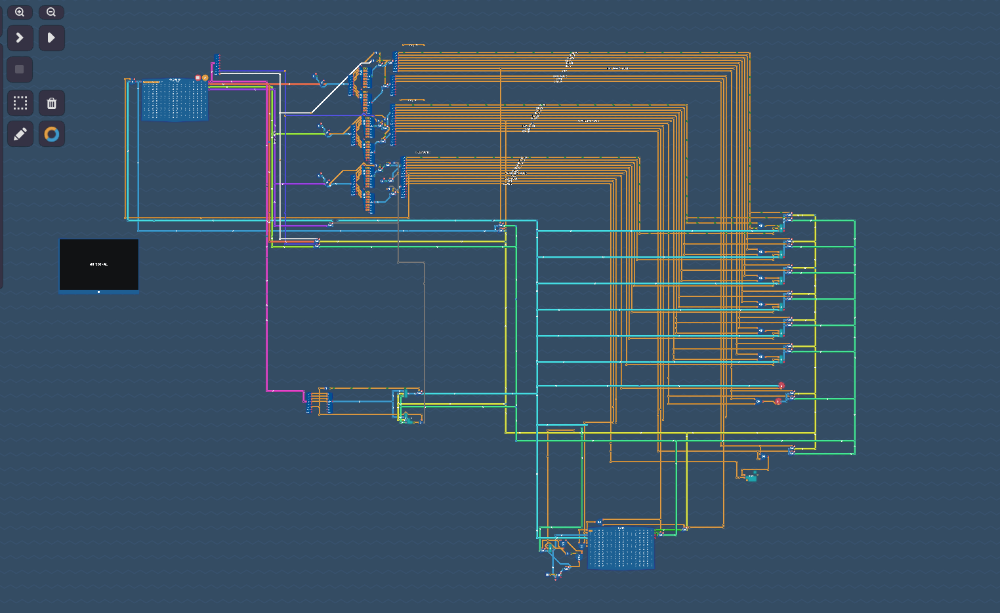
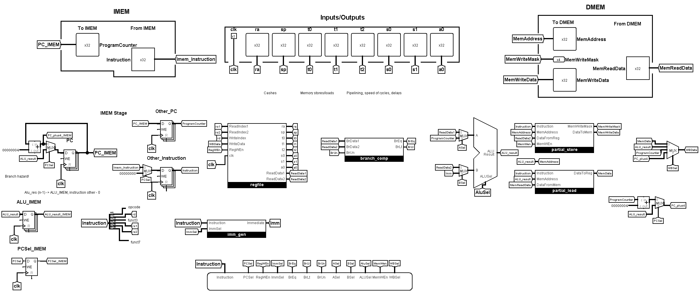

# RISC-V RV32i CPU Core

A fully functional 32-bit RISC-V processor built in Logisim Evolution.

## Specs & Capabilities

- **Architecture:** 2-Stage Pipeline (Fetch | Execute & Writeback).
- **Instruction Set:** RISC-V RV32I.
- **Hazard Handling:** Active pipeline flushing on branches to kill stale instructions.
- **Proof of Compute:** Natively runs multi-cycle programs. It calculates Fibonacci sequences and exponential functions right out of the box.

## The Evolution

This was the most pleaserufull journey in cs I had so far.

- **Level 1 (Left):** I started from basic logic gates and single-cycle CPUs in the game _Turing Complete_.
  
- **Level 2 (Right):** This repo. Moving to an industry-standard ISA and handling pipeline hazards.

## TODO

I left a few tedious implementation details out because they don't change the core logic:

1. **The Register File:** I only wired the 9 essential ABI registers (`x0`, `ra`, `sp`, `t0-t2`, `s0-s1`, `a0`). The decoder handles all 32.
2. **Memory Loads:** `lb` and `lh` (byte/half-word loads) currently use zero-extension instead of sign-extension.

## The Hardware

### Main Pipeline Datapath

### Register File Routing

